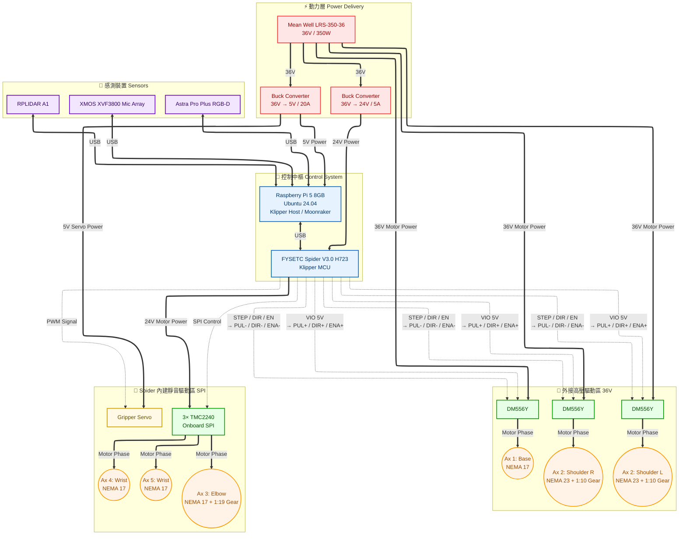

# Moveo-AI: Rebirthing the Giant 3D-Printed Robot Arm with Klipper & Agentic AI

🚀 **Project Vision**
In the 2010s, I built a BCN3D Moveo and shared it on Instructables under the “Ivan Chuang made it!” section of the Build a Giant 3D Printed Robot Arm project. Now, it is time to give it a complete “brain and nervous system transplant.”

This project documents Moveo’s evolution from the traditional 8-bit Arduino / RAMPS architecture to a modern, high-performance system based on a 32-bit controller and Klipper. Future development will integrate Agentic AI, computer vision, speech recognition, and microphone-array-based DOA localization, with the goal of progressively enabling true embodied AI interaction on this classic 3D-printed robotic arm.

---

## 🛠 Phase 1: Hardware Core & Power System — Completed
The goal of this phase was to build a robust electrical foundation for the Moveo and completely replace the original 8-bit Arduino / RAMPS control architecture.

The new control cabinet has now been fully assembled, wired, powered on, and validated, providing the hardware foundation for the next stage of physical motion bring-up.

### ⚡ Key Upgrades & Hardware
- **Compute (Brain)**: Raspberry Pi 5 (8GB) with NVMe storage, powered by a dedicated industrial 5V / 20A buck converter.
- **Controller (Spine)**: FYSETC Spider V3.0 H7 (STM32H723), running Klipper and communicating with the Raspberry Pi through CAN.
- **Power System**: Mean Well LRS-350-36 36V / 350W main power supply, with dedicated 24V and 5V buck converters for the controller, computer, servo, and auxiliary loads.
- **Hybrid Motion System**:
  - **High-Power External Drives (Axis 1 & 2)**: 3 × DM556Y operating directly from the 36V rail for the high-torque motors.
  - **Ultra-Silent Onboard Drives (Axis 3 to 6)**: 3 × TMC2240 installed on the Spider and powered from the 24V rail for the remaining joints.
- **Shoulder Joint Reinforcement**: The shoulder joint uses dual NEMA 23 motors with 1:10 planetary gearboxes, providing the torque required for one of the most heavily loaded joints of the Moveo.

### 🚧 Motion Bring-Up — In Progress

Current work:

- finalize `printer.cfg`
- verify STEP / DIR / EN mappings
- verify motor direction
- configure joint parameters
- configure limit switches and homing
- validate gripper operation
- perform controlled physical joint motion

Klipper and Moonraker are installed and running on the Raspberry Pi 5, and the Spider H7 MCU has been successfully detected through CAN.

### 📐 System Architecture
Below is the electrical and communication flow of the Moveo-AI system:

---

## 📈 Roadmap

- **Phase 1: Electrical & Mechanical Core Overhaul — Completed**  
  Raspberry Pi 5, FYSETC Spider V3.0 H7, 36V power system, DM556Y / TMC2240 hybrid motor control, dual NEMA 23 shoulder motors with 1:10 planetary gearboxes, and the completely rebuilt control cabinet.

- **Phase 2: Klipper Motion Control & 6-Axis Bring-Up — In Progress**  
  Klipper configuration, joint-by-joint motor validation, homing and limit configuration, motor synchronization, motion calibration, speed / acceleration tuning, and reliable 6-axis physical motion.

- **Phase 3: Embodied & Agentic AI Integration — Planned**  
  RGB-D vision and object localization, coordinate transformation and inverse kinematics, Agentic AI task planning, Whisper speech recognition, microphone-array DOA localization, TTS interaction, and vision-guided robotic manipulation.

---

## 🤝 About the Author

I am **Ivan Chuang**, a hardware developer, maker, and robotics enthusiast. This project is both a tribute to the classic BCN3D Moveo design (shoutout to *Toglefritz*, the creator of *Build a Giant 3D Printed Robot Arm*) and a forward-looking exploration into bringing classic open-source hardware into the age of **Embodied AI**.

---
## 📄 License
This project is open-sourced under the MIT License. Feel free to star, fork, and contribute!

    
